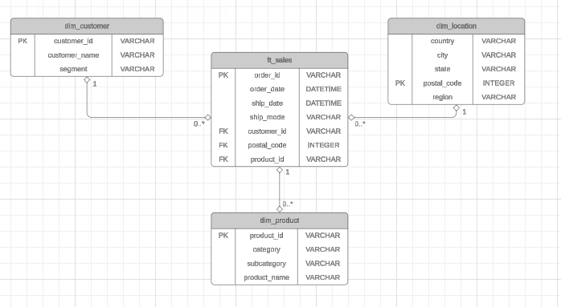

# Projeto Data Warehouse Superstore

# Objetivo
Construir um Data Warehouse local do zero com os dados da Superstore retirados do Kaggle.

# Etapas
- Criar o Diagrama do DW com Lucid Chart.
- Criar DW com linguagem SQL.
- Dividir a tabela principal em csv, em tabelas dimensões e fato, de acordo com o diagrama desenhado.
- Tratar os dados e fazer a ingestão através da linguagem Python.

# Ferramentas utilizadas
- MYSQL Workbench
- Python
  - SqlAlchemy
  - Pandas
  - Numpy
  - Mysql Connector
